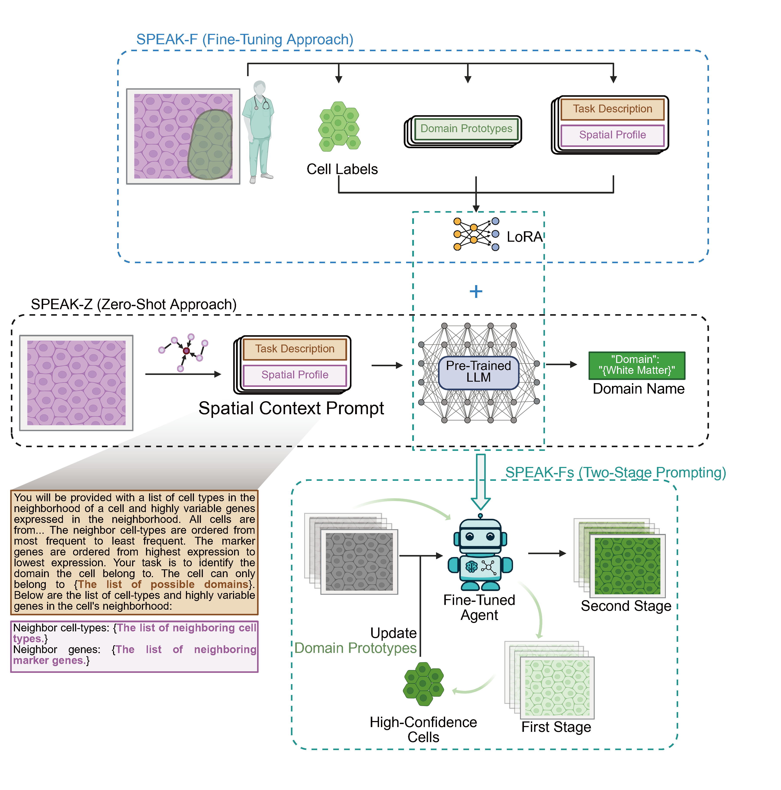

# SPEAK

**SPEAK: Spatial Prompting with Expert Aligned Knowledge for Tissue Domain
Identification in Spatial Transcriptomics**



[Preprint](https://doi.org/10.64898/2026.06.22.733750) ·
[bioRxiv landing page](https://www.biorxiv.org/content/10.64898/2026.06.22.733750v1)

SPEAK is a large-language-model-based method for identifying spatial tissue
domains from spatially resolved transcriptomic data. It converts the cellular
composition and marker-gene activity in each cell or spot neighborhood into a
structured natural-language prompt, allowing an LLM to combine its prior
biological knowledge with expert-provided tissue-domain knowledge.

The public repository contains the method implementation, zero-shot and
expert-aligned fine-tuning workflows, evaluation and benchmark code, a compact
STARmap example, and three small machine-readable source-data tables. Complete
paper inputs, outputs, and expensive intermediates are distributed through
[Figshare](https://doi.org/10.6084/m9.figshare.33043091).

## Overview

SPEAK supports three related analysis modes:

1. **Zero-shot inference** uses a tissue description, candidate domain names,
   and the observed cell-type and marker-gene composition of each spatial
   neighborhood.
2. **Expert-aligned fine-tuning** uses a small expert-selected set of cells or
   spots as prototypes for adapting the model to the tissue under study.
3. **Prototype updating and two-stage prompting** transfers the learned
   prototypes to other tissue sections, selects confident predictions, and
   updates/refines the domain annotations.

For each observation, the workflow:

1. constructs a spatial-neighborhood graph from the supplied coordinates and
   radius;
2. summarizes neighboring cell types and, when requested, representative
   marker genes;
3. converts the neighborhood summary into a tissue-aware prompt;
4. obtains a domain prediction from a cloud or local LLM;
5. restores labels for observations with duplicate prompts, avoiding redundant
   model calls;
6. spatially refines the predicted labels; and
7. evaluates predictions against optional reference domains.

The preprint applies SPEAK to STARmap, Visium, MERFISH, and Xenium data and
reports domain-prediction accuracy, robustness, biological interpretability,
and transfer to other tissue sections.

## Quick start

### 1. Install the environment

```bash
conda env create -f environment/environment.yml
conda activate speak
python -m pip install -e .
cp environment/.env.example .env
```

The environment uses Python 3.12 and installs the notebook, Gemini, and testing
extras. Alternatively, install only the required Python package and selected
extras with `python -m pip install -e '.[notebooks,gemini,test]'`.

### 2. Configure provider credentials

```bash
export OPENAI_API_KEY="your_openai_api_key"
export GOOGLE_API_KEY="your_google_api_key"  # only for Gemini
export API_KEY="$GOOGLE_API_KEY"              # name read by current Gemini notebook cells
```

Credentials must remain in environment variables and must never be committed
to a YAML file, notebook, model request, or model response.

### 3. Run a bundled zero-shot example

STARmap BZ5 is the smallest complete example:

```bash
jupyter lab workflows/starmap/zeroshot.ipynb
```

The notebook reads `examples/starmap/BZ5/` through the portable path helpers,
constructs prompts, generates provider requests, processes predictions,
spatially refines labels, and plots/evaluates the result.

The root-level `zeroshot_notebook.ipynb` is retained as a detailed annotated
tutorial. It preserves explanatory outputs and step-by-step notes about data
loading, request generation, batch submission, result retrieval, and downstream
operations; the workflow notebook above remains the compact canonical entry point.

The corresponding entry points for the other datasets are:

| Dataset              | Zero-shot entry point                                                 | Configuration                          |
| -------------------- | --------------------------------------------------------------------- | -------------------------------------- |
| STARmap              | `workflows/starmap/zeroshot.ipynb`                                    | `configs/config_zeroshot_starmap.yaml` |
| Visium / spatialLIBD | `workflows/visium_libd/zeroshot_libd.ipynb` or `run_zeroshot_libd.py` | `configs/config_zeroshot_libd.yaml`    |
| MERFISH              | `workflows/merfish/zeroshot_merfish.ipynb`                            | `configs/config_zeroshot_merfish.yaml` |
| COPD Xenium          | `workflows/copd/zeroshot_copd.ipynb`                                  | `configs/config_zeroshot_copd.yaml`    |

Fine-tuning and transferred-prototype entry points are located beside the
zero-shot workflow for each dataset.

## Input data format

### CSV input for single-cell spatial data

SPEAK accepts the following files in one sample directory:

| File           | Required | Contents                                                                                                              |
| -------------- | -------- | --------------------------------------------------------------------------------------------------------------------- |
| `data.csv`     | Yes      | Cell-by-gene expression matrix. The first column is the stable cell identifier and the remaining columns are genes.   |
| `celltype.csv` | Yes      | Cell-type annotations with one row per cell. A single categorical column is converted to one-hot neighborhood counts. |
| `pos.csv`      | Yes      | Spatial coordinates, normally columns `x` and `y`, indexed by the same cell identifiers.                              |
| `domain.csv`   | No       | Reference domain/niche labels used only for evaluation and result visualization.                                      |

All files must use compatible observation identifiers. If `domain.csv` is not
provided, SPEAK can still predict domains, but supervised evaluation metrics
cannot be calculated.

### Spot-level and AnnData input

For spot-level data, the cell-type input can instead contain one proportion
column per cell type, for example deconvolution proportions for each Visium
spot. SPEAK uses the dominant type as the spot label while retaining the full
proportion matrix for prompt construction.

The data loader also supports:

- H5AD files with expression in `X`, observation annotations in `obs`, and
  coordinates in `obsm['spatial']`; and
- 10x Visium `filtered_feature_bc_matrix.h5` files with the matching `spatial/`
  directory and optional metadata/deconvolution tables.

The local STARmap schema is documented under `examples/starmap/`. The complete
deposited data layout is documented in `docs/DATA_LAYOUT.md`.

## Configuration

SPEAK uses YAML files in `configs/`. The main parameters inherited from the
original compact example are listed below.

### Data and neighborhood parameters

| Parameter                | Meaning                                                                                                                |
| ------------------------ | ---------------------------------------------------------------------------------------------------------------------- |
| `data_name`              | Sample identifier, for example `BZ5` or `MERFISH_25`.                                                                  |
| `r`                      | Spatial radius used to define neighboring cells or spots. It must be chosen in the coordinate units of the input data. |
| `tissue_region`          | Human-readable tissue/region description included in the prompt when enabled.                                          |
| `celltype_name`          | Name assigned to the categorical cell-type field.                                                                      |
| `pos_name`               | Coordinate columns, normally `["x", "y"]`.                                                                             |
| `name_truth`             | Optional reference-domain column used for evaluation.                                                                  |
| `minimal_f`              | Minimum neighborhood cell-type frequency retained in a prompt.                                                         |
| `top_n`                  | Number of top neighborhood features/genes retained.                                                                    |
| `minimal_gene_threshold` | Minimum marker-gene value retained in gene-aware prompts.                                                              |

### Model and prompt parameters

| Parameter          | Meaning                                                                                                                                |
| ------------------ | -------------------------------------------------------------------------------------------------------------------------------------- |
| `model_type`       | Analysis mode, such as `zeroshot_end2end` or `finetunePro`.                                                                            |
| `gpt_model`        | Provider model identifier. Use a model available to your account; changing it creates a new experimental condition.                    |
| `openai_url`       | Batch request endpoint, normally `/v1/chat/completions`.                                                                               |
| `Graph_type`       | Prompt features: `count` for cell-type composition, `countPlusGenes` for composition plus marker genes, or `GeneOnly` for genes alone. |
| `use_full_name`    | Expand cell-type abbreviations through `cell_names_mapping`.                                                                           |
| `with_self_type`   | Include the focal observation's cell type.                                                                                             |
| `with_region_name` | Include the tissue-region description.                                                                                                 |
| `with_domain_name` | Include the candidate tissue-domain terminology.                                                                                       |
| `with_numbers`     | Include numeric frequencies/expression values instead of ranks alone.                                                                  |
| `with_negatives`   | Include configured negative examples.                                                                                                  |
| `with_CoT`         | Enable the configured reasoning instruction. This is disabled in the reported default configurations.                                  |
| `oneshot_prompt`   | Optional manually supplied demonstration prompt.                                                                                       |
| `system_prompt`    | Optional system-level instruction override.                                                                                            |

### Output and expert-alignment parameters

| Parameter          | Meaning                                                                                 |
| ------------------ | --------------------------------------------------------------------------------------- |
| `output_type`      | Expected output concept, normally `niche`.                                              |
| `confident_output` | Request/extract a confidence indicator when supported by the prompt.                    |
| `replicate`        | Filename suffix distinguishing independent runs and experimental conditions.            |
| `prototype_p`      | Fraction used for prototype-based expert alignment; zero denotes no prototype fraction. |

`domain_mapping` maps numeric/reference domain identifiers to the
human-readable candidate microenvironment names presented to the LLM.
`cell_names_mapping` optionally translates abbreviated cell types into full
biological names when `use_full_name: true`.

## Model execution

### OpenAI Batch API

The dataset notebooks use `generate_json_end2end` to split prompts into
line-delimited Batch API request files under `batch_json/`. After generating
the requests, submit them with:

```bash
python -m src.submit_end2end \
  configs/config_zeroshot_starmap.yaml BZ5 _rep1
```

The submission is asynchronous. Completed response files are saved under
`batch_results/` and can be read with `process_batch_results` in the notebook.
The exact requests and responses used for the paper are available in the
Figshare data package. After download, place them under
`examples/intermediates/model_requests/` and
`examples/intermediates/model_responses/` so the reported runs can be audited
without repeating paid API calls.

### Gemini

The notebooks and `workflows/visium_libd/run_zeroshot_gemini_libd.py` provide a
direct Gemini alternative. It generates the same neighborhood prompts, sends
them synchronously, parses the returned domain labels, and stores row-level
results. Treat a provider or model change as a new experimental condition and
record the model name and replicate in the output.

### Local LLMs

Local inference utilities are in `src/cli/vllm_infer.py` and
`src/cli/gather_localllm_results.py`. The exact JSONL predictions and processed
comparison tables are distributed in the Figshare data package under
`examples/intermediates/local_llm_results/`.

## Paper datasets

| Dataset              | Samples included             | Availability and expected path |
| -------------------- | ---------------------------- | ------------------------------ |
| STARmap              | BZ5, BZ9, BZ14               | Included at `examples/starmap/` |
| Visium / spatialLIBD | 151507–151510, 151669–151676 | Figshare → `examples/visium_libd/` |
| MERFISH              | MERFISH_25–MERFISH_29        | Figshare → `examples/merfish/` |
| COPD Xenium          | 230267_Slide2                | Figshare → `examples/copd/230267_Slide2/` |

The COPD analysis is restricted to `230267_Slide2`. The deposited directory
contains the processed method input, selected training-cell IDs, zero-shot and
fine-tuned annotations, complete SMC differential-expression statistics, and
marker-expression source data used by the figures.

## Repository layout

```text
src/                         reusable SPEAK method, evaluation, and CLI code
zeroshot_notebook.ipynb      annotated end-to-end tutorial with preserved outputs
workflows/                   STARmap, Visium/LIBD, MERFISH, and COPD workflows
analysis/benchmarks/         metric aggregation and model comparisons
configs/                     model and workflow configuration
examples/starmap/            compact BZ5/BZ9/BZ14 runnable inputs
examples/source_data/        three small machine-readable source tables
docs/                        data layout, availability, and reproducibility
environment/                 pinned Python and R environments
tests/                       unit tests
```

The complete Figshare package can be placed under `examples/` using the layout
in `docs/DATA_LAYOUT.md`; environment variables can select an external location.

## Recompute evaluation metrics

```bash
# after downloading the complete Figshare data package
speak-evaluate \
  examples/results/zeroshot_starmap/refined/gpt4o_mini_results/BZ5_with_refined_zeroshot_end2end_True_True_True_count_True_False_True_True_rep1.csv \
  reproduced_metrics.csv \
  --truth niche_truth \
  --prediction zeroshot_gpt4o_mini_refined \
  --x x --y y \
  --dataset starmap --sample BZ5 --model gpt4o-mini --replicate 1
```

The evaluator calculates adjusted Rand index (ARI), normalized mutual
information (NMI), homogeneity (HOM), completeness (COM), CHAOS, percentage of
abnormal spots (PAS), and spatial average silhouette width (ASW). CHAOS, PAS,
and ASW follow the SDMBench definitions used for the reported benchmark.

## Offline validation

```bash
speak-validate-release --strict
speak-smoke-test
pytest
```

The smoke test uses bundled STARmap BZ5 data and does not call a model
provider. API inference is intentionally excluded because it requires user
credentials, can incur charges, and may not be deterministic.

## Reproduction order

1. Run the bundled STARmap example directly, or download the complete Figshare
   data package into the documented `examples/` layout.
2. Run the dataset workflow documented in `workflows/<dataset>/README.md`.
3. Reuse the deposited requests/responses or generate a new recorded model run.
4. Save row-level annotations under `examples/results/`.
5. Recompute metrics with `speak-evaluate`.
6. Use the deposited results and source tables for downstream analyses.

See `docs/REPRODUCIBILITY.md` for the full paper-specific order and
`examples/README.md` for the GitHub/Figshare data boundary.

## Citation

If you use SPEAK, please cite:

> Wei, H. et al. SPEAK: Spatial Prompting with Expert Aligned Knowledge for
> Tissue Domain Identification in Spatial Transcriptomics. *bioRxiv*
> 2026.06.22.733750 (2026).
> https://doi.org/10.64898/2026.06.22.733750

```bibtex
@article{wei2026speak,
  title   = {SPEAK: Spatial Prompting with Expert Aligned Knowledge for Tissue Domain Identification in Spatial Transcriptomics},
  author  = {Wei, Huanhuan and Luo, Xiao and Yu, Hongyi and Liang, Jinping and Yang, Luning and Sauler, Maor and Kaminski, Naftali and Popa, Alexandra and Yan, Xiting},
  journal = {bioRxiv},
  year    = {2026},
  doi     = {10.64898/2026.06.22.733750},
  url     = {https://doi.org/10.64898/2026.06.22.733750}
}
```

## License and data terms

The code is released under the MIT License. Original public datasets and
model-provider outputs retain their applicable source terms. When redistributing
or reusing the bundled or deposited processed inputs, cite the original datasets
as well as the SPEAK data/code release.
